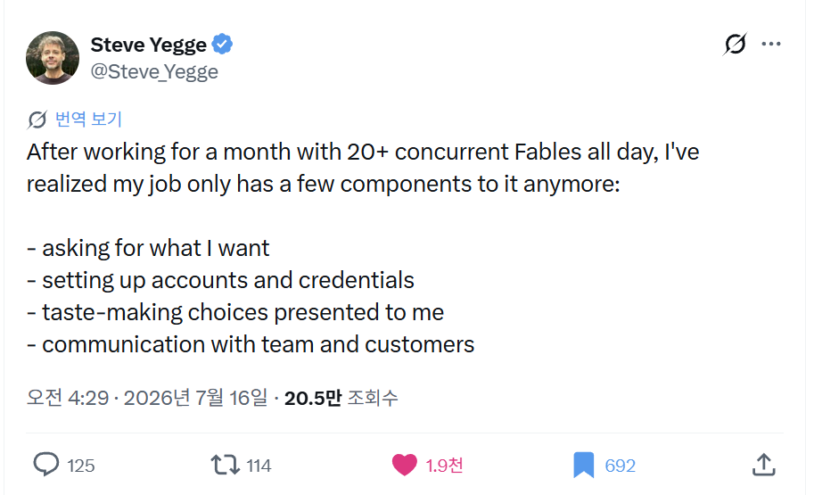

<section class="researcher-role-summary" aria-labelledby="researcher-role-summary-title">
  
AI-NATIVE RESEARCH

  <h2 id="researcher-role-summary-title">
    AI가 연구를 병렬화하면, 
    연구자의 일은 네 가지로 수렴한다
  </h2>
  

    
After working all day with 20+ concurrent AI agents, I've realized a researcher's job only has a few components to it anymore:

    
하루 종일 20개가 넘는 AI agent와 동시에 연구해 보니, 이제 연구자의 일은 몇 가지로만 이루어진다는 것을 깨달았다.

  

  

    <article class="researcher-role-card">
      01
      
specifying what I want to know and what evidence would count

      
무엇을 알고 싶은지, 어떤 증거면 충분한지 명세하기

    </article>
    <article class="researcher-role-card">
      02
      
building and connecting the infrastructure that produces comparable evidence

      
데이터·코드·연산자원·평가환경을 연결해 비교 가능한 증거 생산 체계를 만들기

    </article>
    <article class="researcher-role-card">
      03
      
making taste-driven choices about questions, experiments, and claims

      
제시된 질문·실험·주장 중 가치 있고 믿을 만한 것을 안목으로 판별하기

    </article>
    <article class="researcher-role-card">
      04
      
aligning people and agents, and taking responsibility for the final claim

      
학생·공동연구자·리뷰어·연구비 제공자와 소통하고, AI agent를 정렬하며, 최종 과학적 주장에 책임지기

    </article>
  

</section>

## 배경과 동기

40년 가까이 소프트웨어 업계에서 일해 온 엔지니어이자 개발 문화 논객인 Steve Yegge는 2026년 7월 16일, 한 달 동안 하루 종일 20개가 넘는 Fable을 동시에 운용해 본 뒤 자신의 일이 이제 몇 가지로 수렴했다고 적었다.

*Steve Yegge의 2026년 7월 16일 X 게시물. 이미지를 누르면 원문으로 이동한다.*

> After working for a month with 20+ concurrent Fables all day, I've realized my job only has a few components to it anymore:
>
> 한 달 동안 하루 종일 20개가 넘는 Fable을 동시에 운용해 보니, 이제 내 일은 몇 가지로만 이루어진다는 것을 깨달았다.
>
> - asking for what I want
>   - 내가 원하는 것을 요청하기
> - setting up accounts and credentials
>   - 계정과 인증 정보 설정하기
> - taste-making choices presented to me
>   - 제시된 선택지 가운데 좋은 것을 감식하고 선택하기
> - communication with team and customers
>   - 팀 및 고객과 소통하기

이 관찰에서 흥미로운 점은 단순히 “AI가 코딩을 대신한다”는 데 있지 않다. 여러 agent가 구현과 실행을 병렬로 맡기 시작하면 인간의 일은 사라지기보다, **무엇을 원하는지 정의하고, 그것이 가능하도록 환경을 만들고, 수많은 결과 중 좋은 것을 판별하며, 사람들과 방향을 맞추는 상위 수준의 판단**으로 이동한다는 데 있다.

그렇다면 같은 변화가 연구에서 일어난다면 연구자의 일은 무엇으로 수렴할까? 연구실에서도 여러 AI agent가 문헌을 읽고, 코드를 작성하고, 실험을 설계하고, 결과를 분석하는 상황을 가정해 Steve Yegge의 네 가지 항목을 연구자의 언어로 옮겨 보았다. 다만 소프트웨어가 잘 작동하는지를 넘어, 연구에는 어떤 결과를 지식으로 받아들이고 어디까지 주장할 것인지에 대한 책임이 남는다.

그래서 이 질문을 ChatGPT에 던졌고, 아래는 그때 얻은 답변이다. 표현과 논리의 흐름은 손대지 않고 그대로 보존했다.

원문: [Steve Yegge의 X 게시물](https://x.com/Steve_Yegge/status/2077475727327604932?s=20)

---

연구자 버전으로 바꾸면 대략 이렇게 될 것 같아.

> 하루 종일 20개 이상의 AI agent와 동시에 연구하다 보니, 연구자의 일은 이제 몇 가지로 수렴한다.
>
> * 무엇을 알고 싶은지 정확히 정의하기
> * 데이터·코드·연산자원·평가환경을 구축하고 연결하기
> * 제시된 수많은 연구 선택지 중 좋은 방향을 판별하기
> * 학생·공동연구자·리뷰어·연구비 제공자와 소통하기
> * 그리고 최종적으로, 무엇을 과학적 사실로 주장할 수 있는지 책임지기

그런데 연구에서는 원문의 네 가지에 **마지막 항목이 반드시 하나 더 붙어야 해.** 소프트웨어 제작에서는 결과물이 잘 작동하면 상당 부분 끝나지만, 연구에서는 “그럴듯한 결과”와 “참인 지식”을 구분해야 하기 때문이야.

---

## 1. “Asking for what I want”

### → 연구 질문과 성공 조건을 명세하는 일

AI 시대에 가장 중요해지는 능력은 프롬프트를 잘 쓰는 능력이라기보다, **연구 문제를 명세 가능한 형태로 바꾸는 능력**이야.

예를 들어,

* “장기 메모리를 잘하는 로봇”
* “자연어 추론이 가능한 spatial intelligence”
* “현실에서 강건한 VLN”

같은 문장은 연구 방향은 되지만 아직 실행 가능한 질문은 아니야.

연구자는 이것을 다음처럼 분해해야 해.

* 기존 방법은 정확히 어떤 상황에서 실패하는가?
* 실패 원인은 표현, 기억, 추론, 제어 중 어디에 있는가?
* 어떤 관측이 있다면 가설을 반증할 수 있는가?
* 성능 향상이 아니라 어떤 새로운 capability를 보일 것인가?
* benchmark improvement와 scientific insight 중 무엇이 핵심인가?

AI agent는 주어진 문제를 빠르게 풀 수 있지만, **무슨 문제가 풀 가치가 있는지는 스스로 안정적으로 결정하지 못해.**

그래서 연구자의 첫 번째 역할은 점점 더 “solver”보다 **problem specifier**에 가까워져.

---

## 2. “Setting up accounts and credentials”

### → 연구 인프라와 증거 생산 파이프라인을 설계하는 일

연구자에게 계정과 credential은 단순 행정이 아니라 더 넓은 의미의 **research infrastructure**야.

* 데이터 접근 권한
* GPU와 클러스터
* 실험 환경
* 로봇 하드웨어
* 코드 저장소와 branch 정책
* 데이터 버전과 annotation
* experiment tracking
* benchmark evaluator
* 재현 가능한 container
* 논문·특허·보안 관련 권한

AI가 코드를 무한히 생성할수록, 오히려 중요한 건 “코드를 만드는 것”이 아니라 **생성된 실험이 동일한 조건에서 비교 가능한가**가 돼.

앞으로 교수나 PI의 역할은 이런 쪽으로 이동할 가능성이 커.

> 개별 실험을 직접 수행하는 사람
> → 다수의 agent와 학생이 생성한 증거를 일관되게 축적할 수 있는 연구 운영체계를 만드는 사람

실제로 20개의 agent가 각각 코드를 잘 짜도,

* dataset split이 다르고
* metric 정의가 다르고
* seed 처리가 다르고
* baseline implementation이 다르고
* cherry-picking 규칙이 다르면

그 결과는 연구 지식으로 합쳐지지 않아.

즉, **연구 자동화의 병목은 코드 생성이 아니라 epistemic infrastructure**가 될 가능성이 높아.

---

## 3. “Taste-making choices presented to me”

### → 과학적 취향과 연구 판단

이 부분이 가장 핵심이야.

AI가 후보를 많이 만들어낼수록 연구자는 더 이상 아이디어를 “생산”하는 사람만이 아니라, 아이디어를 **선별하고 방향성을 부여하는 사람**이 돼.

연구에서 taste는 단순히 예쁘고 세련된 것을 고르는 취향이 아니야. 적어도 다음을 함께 판단하는 능력이야.

### 중요성

* 이 문제가 실제로 중요한가?
* 특정 benchmark에만 존재하는 인공적인 문제는 아닌가?
* 성공하면 연구 분야의 사고방식을 바꿀 수 있는가?

### 새로움

* 새로운 component인가?
* 새로운 formulation인가?
* 새로운 capability인가?
* 아니면 기존 방법의 조합인가?

### 정합성

* motivation, method, experiment, conclusion이 같은 질문을 보고 있는가?
* 주장보다 실험이 약하지 않은가?
* 실험은 좋지만 논문의 중심 메시지가 분산되지 않았는가?

### 단순성

* 복잡한 방법이 실제 문제의 본질을 해결하는가?
* 더 간단한 설명이나 baseline으로 같은 결과가 나오지 않는가?

### 연구 프로그램과의 연결성

* 한 편의 논문으로 끝나는가?
* 다음 세 편을 낳을 수 있는가?
* 연구실만의 데이터, 시스템, insight를 축적하는가?

AI는 “그럴듯한 선택지”를 대량 생성하는 데는 강하지만, **어떤 선택이 3년 뒤에도 가치가 있을지 판단하는 taste는 축적된 실패 경험과 분야 감각에 크게 의존해.**

따라서 앞으로 senior researcher의 희소성은 아이디어 개수보다 **좋은 아이디어를 조기에 알아보는 precision**에서 생길 거야.

---

## 4. “Communication with team and customers”

### → 학생·공동연구자·학계·연구비 제공자와의 정렬

연구에는 일반 기업의 customer와 정확히 대응되는 단일 고객이 없어. 대신 여러 이해관계자가 있어.

| 일반 조직   | 연구 조직                                    |
| ------- | ---------------------------------------- |
| 팀원      | 학생, 포닥, 공동연구자                            |
| 고객      | 학계, 리뷰어, 산업 파트너, 과제 평가자                  |
| 제품 요구사항 | 연구 질문과 기대 capability                     |
| 제품 데모   | 정량 실험, 정성 결과, 시스템 데모                     |
| 제품 문서   | 논문, supplementary, code, dataset         |
| 매출·사용량  | citation, adoption, 후속 연구, 실제 deployment |

연구 리더의 중요한 역할은 각 사람이 같은 질문을 풀도록 만드는 거야.

학생 A는 method novelty를 보고 있고, 학생 B는 시스템 구현을 하고 있고, 교수는 capability를 주장하고 있는데 리뷰어는 benchmark paper로 읽는다면, 각자 열심히 했어도 논문은 무너져.

AI가 실무를 빠르게 할수록 오히려 다음 능력이 더 중요해져.

* 연구 질문을 한 문장으로 반복적으로 정렬하기
* 학생에게 “무엇을 구현할지”가 아니라 “어떤 불확실성을 제거할지” 설명하기
* 결과가 나왔을 때 그것이 무엇을 의미하고 의미하지 않는지 합의하기
* reviewer가 오해하지 않도록 evidence hierarchy를 설계하기
* 과제 평가자에게 기술 개발이 아니라 국가적·산업적 capability gap으로 전달하기

즉, communication은 연구 결과를 포장하는 마지막 단계가 아니라, **연구 과정 전체를 동일한 epistemic objective에 정렬시키는 제어 루프**야.

---

## 5. 연구에는 반드시 추가되어야 하는 항목

### “Deciding what I am willing to claim”

이게 일반적인 agent orchestration과 연구를 구분하는 핵심이라고 봐.

AI가 만들어준 분석은 매우 빠르고 그럴듯할 수 있어. 하지만 연구자는 최종적으로 다음을 판단해야 해.

* 이 결과가 우연이 아닌가?
* confounder가 제거됐는가?
* baseline이 공정한가?
* metric이 정말 주장하는 capability를 측정하는가?
* 실패 사례를 숨기지 않았는가?
* 데이터 누수가 없는가?
* 논문 문장이 실험보다 과장되지 않았는가?
* 다른 연구자가 재현할 수 있는가?

앞으로 연구자의 핵심 산출물은 코드나 문장이 아니라 **신뢰할 수 있는 주장(claim)**이 될 거야.

AI가 그림, 문장, 코드, 실험을 모두 생성해도 저자의 이름을 올린다는 것은 결국,

> “나는 이 주장을 검토했고, 이 증거가 이 결론을 지지한다고 책임진다.”

는 의미가 돼.

따라서 AI 시대 연구자의 권위는 지식을 많이 기억해서가 아니라, **어떤 주장을 승인하지 않을지를 아는 능력**에서 나올 수 있어.

---

# 연구자 업무가 어떻게 재편될까

전통적인 연구 업무를 거칠게 나누면 다음과 같았어.

1. 논문 읽기
2. 아이디어 만들기
3. 수식 유도
4. 코드 작성
5. 실험 수행
6. 결과 분석
7. 논문 작성

AI agent가 강해지면 3–7의 상당 부분이 자동화돼. 하지만 실제로 연구자의 일이 줄어든다기보다 상위 계층으로 이동해.

## 이전

> 내가 하나의 가설을 세우고 직접 구현하고 검증한다.

## 현재

> 학생들과 여러 개의 가설을 병렬로 검증한다.

## 가까운 미래

> 수십 개의 인간–AI 연구 프로세스가 병렬로 탐색한 가설 공간을 관리하고, 의미 있는 증거를 선별해 하나의 연구 주장으로 수렴시킨다.

결국 PI는 점점 다음과 비슷해질 거야.

* 연구 문제의 architect
* 실험 시스템의 operator
* 연구 방향의 editor
* 과학적 주장의 auditor
* 학생과 agent의 orchestrator

---

# 하지만 위험한 함정도 있어

## 1. 직접 연구하는 감각을 잃는 문제

모든 것을 agent에게 요청하고 선택만 하다 보면, 연구자가 데이터와 현상에서 멀어질 수 있어.

그 결과,

* 결과가 왜 이상한지 직관적으로 못 느끼고
* 코드가 물리적으로 말이 되는지 판단하지 못하고
* agent가 제시한 선택지 밖의 가능성을 상상하지 못하며
* “깔끔한 이야기”를 “실제 발견”으로 오인할 수 있어.

연구자는 최소한 주기적으로 직접 다음과 접촉해야 해.

* raw sensor data
* qualitative failure cases
* training curves
* 실제 로봇의 이상 행동
* baseline의 원본 코드
* 개별 샘플 단위의 오류

이런 것을 나는 **contact with reality**라고 부를 수 있을 것 같아.

AI 시대에 hands-on 능력은 생산성을 위해서라기보다, **과학적 감각을 교정하기 위해** 필요해져.

---

## 2. 선택지가 프레임을 제한하는 문제

“presented to me”라는 표현에는 중요한 위험이 있어.

agent가 A, B, C를 제안하면 사람은 그중 하나를 고르는 데 집중하게 돼. 그러나 진짜 좋은 연구는 종종 **A, B, C 모두 잘못된 질문이라는 것을 깨닫는 것**에서 나와.

그래서 연구자는 선택지 평가자에 머물면 안 돼.

> 옵션을 고르는 능력
>
> * 옵션 공간 자체를 재정의하는 능력

이 둘이 모두 필요해.

---

## 3. 연구 속도가 이해 속도보다 빨라지는 문제

agent가 하루에 수십 개의 실험과 문헌 요약을 생산하면, 연구팀이 결과를 이해하고 통합하는 속도가 생성 속도를 따라가지 못해.

그러면 실험은 많아지지만 지식은 쌓이지 않아.

앞으로 중요한 연구 관리 지표는 “몇 개 실험을 돌렸는가”가 아니라,

* 어떤 가설이 폐기됐는가?
* 어떤 불확실성이 줄어들었는가?
* 어떤 연구 판단이 바뀌었는가?
* 어떤 지식이 다음 프로젝트에 재사용 가능한가?

가 되어야 해.

---

# 교수·연구실 관점에서 다시 쓰면

교수의 일은 아마 점점 다음 다섯 가지로 수렴할 가능성이 커.

## 1. **Question formulation**

무엇이 학문적으로 중요하고, 어떤 질문이 풀 수 있으며, 어떤 형태로 검증 가능한지 정의하기.

## 2. **Research system design**

학생·agent·데이터·로봇·GPU·코드가 일관된 증거를 생산하게 만드는 시스템 구축.

## 3. **Taste and prioritization**

수많은 후보 중 연구실의 시간과 학생의 몇 년을 투자할 가치가 있는 방향 선택.

## 4. **Epistemic quality control**

실험 설계, 공정성, 재현성, 통계, claim strength를 검증하기.

## 5. **Alignment and communication**

학생에게는 연구의 본질을, 리뷰어에게는 기여를, 과제 평가자에게는 필요성과 실현 가능성을 전달하기.

---

# 학생 연구자에게 요구되는 능력도 달라져

AI 시대의 좋은 학생은 단순히 코딩을 빠르게 하는 학생이 아닐 가능성이 커.

더 중요해지는 건 다음이야.

* 모호한 문제를 검증 가능한 질문으로 바꾸는 능력
* agent의 출력을 의심하고 검증하는 능력
* 실험 결과를 보고 다음 가설을 생성하는 능력
* 실패 사례에서 구조적 원인을 찾는 능력
* 자기 연구의 핵심 주장을 한 문장으로 설명하는 능력
* 여러 agent를 쓰더라도 연구의 전체 논리를 머릿속에 유지하는 능력

코드를 가장 잘 짜는 학생보다, **무엇을 왜 실험하고 있으며 결과가 무엇을 의미하는지 가장 정확히 아는 학생**이 강해질 거야.

---

# 한 문장으로 정리하면

AI agent 시대의 연구자는 **지식을 직접 생산하는 노동자**에서, **질문·증거·판단·사람을 설계하고 최종 주장에 책임지는 과학적 감독자**로 이동하고 있어.

다만 진정한 경쟁력은 단순한 orchestration이 아니라,

> **좋은 질문을 만들고, 현실과 계속 접촉하며, AI가 만든 수많은 그럴듯한 결과 중 실제 지식만을 승인하는 능력**

에 있을 거야.
